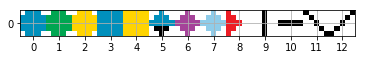
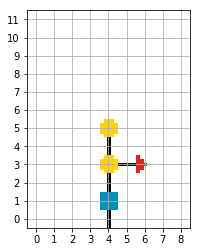
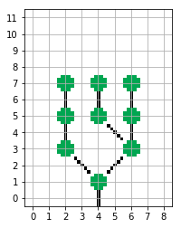
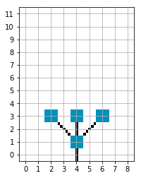
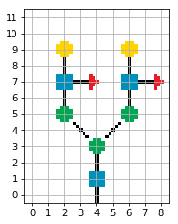
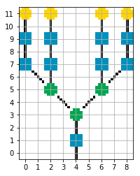
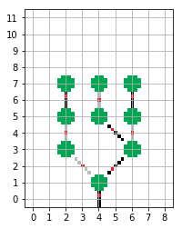

A tool for drawing pixelated glycans.

Reasons to pixelate glycans:
* Drawings are in the form of small numpy arrays.
* Can be used as inputs for machine learning.
* Represent all the information in a glycan's IUPAC.
* Drawing board size and centre positions insure perfect alignment.
* They look really cool. =)

The following elements are available for drawing:

Index | Name | Element
--- | --- | ---
0 | Glucose | Glc
1 | Mannose | Man
2 | Galactose | Gal
3 | N-Acetyl Glucosamine | GlcNAc
4 | N-Acetyl Galactosamine | GalNAc
5 | Galacturonic Acid | GlcA
6 | N-Acetylneuraminic Acid | Neu5Ac
7 | N-Glycolylneuraminic Acid | Neu5Gc
8 | Fucose | Fuc
9 | Vertical Stick | vert_stick
10 | Horizontal Stick | horz_stick
11 | Left Diagonal Stick | left_diag_stick
12 | Right Diagnoal Stick | right_diag_stick

This is how the drawings end up looking like:

  
   
  
  
  

Linkage information can be represented the following way:

Alpha linkages are black, beta linkages are grey and the red dot depicts the occupancy.
